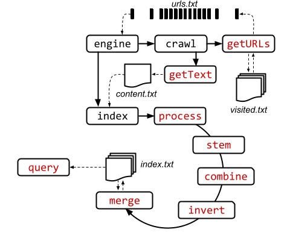

# M0: Setup & Centralized Computing

> Collaboration: Individual milestone
>
> Completion: About 10-12 hours (but might take longer if content is unfamiliar/new.)
>
> Deadline: Monday, Feb. 5, 2024 (11:59PM ET)
>
> Latest handout version: [CS1380:2024:M0](https://docs.google.com/document/d/1kRI-5yP_x2hweOsijDIn2Q1E1acMz3vVTX0LjZVgZbA/edit#heading=h.nsafc3gmp2br)
>
> GitHub repo: <https://github.com/brown-cs1380/m0>


## Table of Contents

- [Introduction](#introduction)
- [Background & Context](#background-and-context)
- [Setting up your environment](#setting-up-your-environment)
- [A Centralized Search Engine](#a-centralized-search-engine)
- [Functionality Checklist](#functionality-checklist)
- [Testing & Production Environments](#testing-and-production-environments)
- [Reflections](#reflections)
- [Tips & Submission](#tips-and-submission)
- [FAQ](#faq)

## Introduction 
This milestone combines several goals: 

1. Set up and familiarize students with the environment and infrastructure used for each of these assignments  
2. Refresh (and confirm) everyone's background on developing systems in the languages and libraries used in this course
3. Develop the distribution-as-a-library abstractions that will form the basis throughout the course
4. Start thinking about modularizing and testing the system throughout the development process. 

A fortunate byproduct is that students will familiarize themselves with environments used extensively in industry: the Docker containment environment, Unix/Linux shell scripts, a popular server-side JavaScript runtime environment, and the Node.js package manager.


## Background and Context

Fundamentally, a search engine for the web is comprised of three components:

- Crawling subsystem, i.e. a subsystem for downloading web content, extracting links, and downloading further content.
- Indexing subsystem, i.e., a subsystem that processes content to extract key features, rank their importance, and restructure content to accelerate answering queries.
- Querying subsystem, i.e., a subsystem that is responsible for receiving a query from a client and responding with the most appropriate content.

For this milestone, we will be developing the simplest possible subsystems using a combination of shell commands and JavaScript modules — enough to get a good sense of these three components. We will also test our implementation, characterize our solution — a preliminary version of the final report—and reflect on some of the design decisions.

The following online resources might be useful for this assignment:

- Docker [installation](https://docs.docker.com/engine/install/) and [usage cheatsheet](https://docs.docker.com/get-started/docker_cheatsheet.pdf)
- Unix and Linux shell scripting [guide](https://tldp.org/LDP/abs/html/index.html) and [cheatsheet](https://devhints.io/bash)
- The Node v.20 LTS [documentation](https://nodejs.org/dist/latest-v20.x/docs/api/) 
- A [primer](https://docs.github.com/en/get-started/quickstart/hello-world) on Git and GitHub

_Please skim the entire assignment before diving into these resources, and only study these resources on a need basis._ In any case, make sure that you use version control—ideally Git and GitHub, possibly with the [educational pack](https://education.github.com/pack)—and that you commit and push frequently.

Under [FAQ](#faq), we have compiled a list of questions that were asked a lot in the previous iteration of the assignment. Make sure to check these out first before asking questions on EdStem or coming to Office Hours!

## Setting up your Environment

The development environment assumes a standard Unix/Linux environment. Windows and Mac OS X users can easily use a Docker container that has been set up with appropriate versions of a Linux distribution (Ubuntu 22.04.3 LTS), userspace utilities (GNU Coreutils v.8.32-4), the ShellCheck linting tool (v. 0.8), a JavaScript engine (Node v20.9.0), the node package manager (v.10.1), and basic support for editing, versioning, and checkpointing.

Using a standardized Docker container has several advantages, even for Linux users:

1. Users avoid incompatibilities between software for this class and other software on your machine
2. In the unfortunate event that something goes wrong, users can simply wipe the container and restart it from a known checkpoint
3. The container image works in every environment, including the grading infrastructure
4. Containerization simplifies deployment in a real distributed environment such as AWS (later in the course).

To set up and use Docker, follow the instructions from [the Docker website](https://docs.docker.com/engine/install/) (or from [CS1680](https://hackmd.io/@csci1680/container-setup)). Then download the course image and follow [the instructions in the README](https://github.com/brown-cs1380/container) file — this will provide you with an appropriate base environment:
```shell
docker pull ghcr.io/brown-cs1380/container:main
```
If you're not planning on using Docker—likely because you are already running a Unix or Unix-based environment such as Linux, OS X, or WSL with appropriate dependencies installed—simply clone the M0 repository from GitHub:
```shell
git clone https://github.com/brown-cs1380/m0
```
Future milestones will be using the corresponding images and repositories without naming them explicitly — simply replace m0 with m1, m2, etc.


## A Centralized Search Engine

The core engine can be written as a single loop, which
1. Reads a URL from a set of URLs
2. Downloads the URL, extracting further URLs and additional content
3. Analyzes the content, to compute inverted indices and add them to the global index.
```bash
while read -r url; do

  if [[ "$url" == "stop" ]]; then
    # stop the engine if it sees the string "stop" 
    break;
  fi

  ./crawl.sh "$url" >d/content.txt
  ./index.sh d/content.txt "$url"

  if  [[ "$(cat d/visited.txt | wc -l)" -ge "$(cat d/urls.txt | wc -l)" ]]; then
      # stop the engine if it has seen all available URLs
      break;
  fi

done < <(tail -f d/urls.txt)
```
The [`crawl.sh`](../crawl.sh) and [`index.sh`](../index.sh) scripts run components in the `c/` (for _code_) directory — for example, [`getURLs.js`](../c/getURLs.js) and [`invert.sh`](../c/invert.sh): [`crawl.sh`](../crawl.sh) downloads pages and [`index.sh`](../index.sh) gradually builds the inverted index. All these scripts read from and write to various data files in the `d/` (for _data_) directory. Various tests showing the structure of intermediate data streams exist in the `t/` directory — feel free to add more tests to check your implementation's correctness. An additional [`query.sh`](../query.sh) script can be used (when implemented) to query the inverted index and return relevant pages. The figure below shows an overview of the system; components in red are not implemented (and are the focus of this milestone).



The entire system applies some basic natural-language processing primitives to extract and store terms, bigrams, and trigrams from these pages — along with pointers to these pages. Most components operate in a streaming fashion—the engine does not stop until it completes—with different elements (web pages) being processed by different processing units: one element might be getting downloaded while another element might be going through link extraction while yet another element might be getting indexed — and the user can still use the tool to extract results from the indices.

Note that the engine cannot be executed as-is: some of its processing units haven't been implemented — it is your task to implement all of them appropriately. 

## Functionality Checklist
Here's a quick checklist of files that you need to modify.

- [`getURLs.js`](../c/getURLs.js): identify and extract URLs
- [`getText.sh`](../c/getText.js): convert an incoming HTML stream to text
- [`process.sh`](../c/process.sh): harmonize text (e.g., convert to lowercase, remove stopwords)
- [`stem.js`](../c/stem.js): replace individual words with their root (stem)
- [`combine.sh`](../c/combine.sh): generate additional bigrams and trigrams from word sequences
- [`invert.sh`](../c/invert.sh): create a mapping from terms to IDs (URLs) of documents that contain them
- [`merge.js`](../c/merge.js): merge the inverted index of the current page with the global inverted index
- [`query.sh`](../query.sh): identify relevant pages using 1–3 search terms

## Testing and Production Environments

When developing software systems, you also need to develop both correctness-oriented tests that confirm that your system operates according to the specification and performance-oriented harnesses that characterize the performance of your system.

We have provided some tests for some of these components; you will need to provide additional tests for these components, as well as tests for other components you've developed.

For end-to-end testing, we have set up a few testing corpora: [a tiny web graph](https://cs.brown.edu/courses/csci1380/sandbox/1/), [a small collection of full books](https://cs.brown.edu/courses/csci1380/sandbox/2/), [a larger collection of book summaries](https://cs.brown.edu/courses/csci1380/sandbox/3), and [a web of quotes](https://cs.brown.edu/courses/csci1380/sandbox/4); smaller corpora can be used to test for correctness and larger corpora can be used to characterize the performance of the system.


## Reflections

As part of your submission, complete the `README.md` markdown file with the following structure, along with answers to the following prompts:
```markdown
# M0: Setup & Centralized Computing

Full name: `<first last>`

Email:  `<email@brown.edu>`

Username:  `<cslogin>`

# Summary

> Summarize your implementation, including key challenges you 
> encountered

My implementation comprises `<number>` software components, 
totaling `<number>` lines of code in the following languages: 
`<number>` lines of shell scripts and `<number>` of JavaScript 
code. 

Key challenges included `<3 challenges and how you overcame them>`.

## Correctness & Performance Characterization

> Describe how you characterized the correctness and performance of 
> your implementation

*Correctness*: My implementation passes `<number>` out of the 
`<number>` tests (`<percentage>`%) already provided for M0. 

I developed another `<number>` tests, which focus on `<..details>`. 
All these tests, combined take `<time>` to complete. 

`<additional approaches for increasing correctness confidence>`.

*Performance*: Evaluating the entire system using the `time` 
command on the three sandboxes reports the following times:

| Name      | Engine   | Query    |
| :-------- | :------- | :------- |
| Sandbox 1 | `<time>` | `<time>` |
| Sandbox 2 | `<time>` | `<time>` |
| Sandbox 3 | `<time>` | `<time>` |

## Time to Complete

> Roughly, how many hours did this milestone take you to complete?

Hours: `<time>`

## Wild Guess

> How many lines of code do you think it will take to build the 
> fully distributed, scalable version of your search engine? 
> (If at all possible, try to justify your answer — even a rough 
> justification about the order of magnitude is enough)

```

## Tips and Submission

Here are some guidelines that might be helpful:

- Make sure you study the provided test cases — their inputs and outputs usually offer significant insights into the expected implementation structure. 
- Write additional tests to confirm that your implementation works as expected; try to test the limits of your implementation in your test.
- Read the documentation of packages — standard and third-party ones. (N.b. the only third-party packages allowed are the ones already provided with the implementation.)
- Execute linters—shellcheck and eslint—frequently, and use the `--fix` flag to correct some of the style errors automatically.

To create a submission, run [s/submit.sh](../s/submit.sh) from the root folder of M0. This will create a `submission.zip` file which you will then upload to [Gradescope](https://www.gradescope.com/) (select "managed submission" and then upload your zip manually). The zip archive will contain a `javascript/src/main` folder inside which all the files tracked by git and found to be modified. Make sure to `git commit` any new files you have created before running the submit script; the [s/submit.sh](../s/submit.sh) script will **not** include any untracked files in the submission.

You are allowed to submit as many times as you want up until the deadline; so _submit early and often_. For full grade, before submitting the final version of your code make sure that 
1. All linters run without any errors
2. The provided tests run without any errors
3. You have provided an additional __five__ or more tests with your implementation.

## FAQ
Here we compiled a list of FAQs.

- Unauthorized error when pulling docker image
    - You need to perform an authentication using your Github token
    - Check out [Authenticating with a personal access token (classic)](https://docs.github.com/en/packages/working-with-a-github-packages-registry/working-with-the-container-registry#authenticating-with-a-personal-access-token-classic)
- Bad interpreter error when running [s/submit.sh](../s/submit.sh)
    - In terminal type, `which env` and note the output
    - Replace the first line of the script with the output from above so that it becomes 
        ```bash
        #!<output> bash
        ```
- Autograder times out 
    - Most likely, this is due to sub-optimal implementation of [`combine.sh`](../c/combine.sh).
      - Our solution do it in one pass
      - The corpus is large, so avoid using subshell to assign every variable in the loop, especially when subshell contains pipes. 
- Cannot find module __xxxxx__
    - Try running `npm install` under `c/` folder.
- Student tests not found on Autograder
    - Name your test files with __s_test__ prefix
      - If the file is testing [`combine.sh`](../c/combine.sh), for example, it should be named `s_test_combine.sh`.
      - Make sure the files are tracked (i.e., added via `git add`)
- Sort order for global index
    - Sort terms alphabetically
    - For sorting urls/counts do a 2-way sort
      - Sort by count in decreasing order
      - Sort urls alphabetically to break ties
## Feedback 

Please let us know if you find any mistakes, inconsistencies, or confusing language in this or any other CS1380 document by filling out the [anonymous feedback form](https://docs.google.com/forms/d/e/1FAIpQLSe-nkb-NFOZaqqfg0CVZYvBDOhtqOitRxS4DBCnfoyVFkFfJw/viewform).
